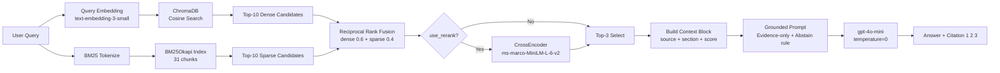

# Architecture — RAG Pipeline (Day 08 Lab)

> Deliverable của Documentation Owner.

## 1. Tổng quan kiến trúc

```
[Raw Docs — 5 tài liệu nội bộ (.txt)]
    ↓
[index.py: Preprocess → Chunk (heading-based) → Embed → Store]
    ↓
[ChromaDB Vector Store — 31 chunks, cosine similarity]
    ↓
[rag_answer.py: Query → (Transform) → Retrieve → (Rerank) → Generate]
    ↓
[Grounded Answer + Citation [1][2]]
```

**Mô tả ngắn gọn:**
Hệ thống RAG hỗ trợ nhân viên tra cứu thông tin từ 5 tài liệu nội bộ (chính sách hoàn tiền, SLA, access control, HR, helpdesk FAQ). Người dùng đặt câu hỏi bằng tiếng Việt hoặc tiếng Anh; pipeline retrieve các đoạn tài liệu liên quan, đưa vào LLM để sinh câu trả lời grounded có trích dẫn nguồn. Nếu không có đủ context, pipeline abstain thay vì bịa thông tin.

---

## 2. Indexing Pipeline (Sprint 1)

### Tài liệu được index
| File | Nguồn (source metadata) | Department | Số chunk |
|------|------------------------|-----------|---------|
| `policy_refund_v4.txt` | policy/refund-v4.pdf | CS | 6 |
| `sla_p1_2026.txt` | support/sla-p1-2026.pdf | IT | 5 |
| `access_control_sop.txt` | it/access-control-sop.md | IT Security | 8 |
| `it_helpdesk_faq.txt` | it_helpdesk_faq.txt | IT | 7 |
| `hr_leave_policy.txt` | hr/leave-policy-2026.pdf | HR | 5 |
| **Tổng** | | | **31 chunks** |

### Quyết định chunking
| Tham số | Giá trị | Lý do |
|---------|---------|-------|
| Chunk size | 400 ký tự (~100 tokens) | Nằm trong khoảng 300–500 tokens theo slide; đủ dài để giữ ngữ cảnh điều khoản, đủ ngắn để tăng độ chính xác khi retrieve |
| Overlap | 80 ký tự | ~20% chunk size — giữ ngữ cảnh liên tiếp qua ranh giới chunk, tránh cắt giữa câu |
| Chunking strategy | Heading-based (ưu tiên split theo tiêu đề `#`, `##`); fallback sang paragraph-based | Tài liệu có cấu trúc heading rõ ràng → split theo heading giữ nguyên semantic unit (một điều khoản = một chunk) |
| Metadata fields | `source`, `section`, `department`, `effective_date`, `access` | `source` phục vụ citation; `section` tăng traceability; `effective_date` phục vụ freshness reasoning; `department` phục vụ filter nếu mở rộng |

### Embedding model
- **Model**: `text-embedding-3-small` (OpenAI)
- **Vector store**: ChromaDB (PersistentClient, local disk)
- **Similarity metric**: Cosine (distance → score = 1 - distance)

---

## 3. Retrieval Pipeline (Sprint 2 + 3)

### Baseline (Sprint 2)
| Tham số | Giá trị |
|---------|---------|
| Strategy | Dense (embedding similarity) |
| Top-k search | 10 |
| Top-k select | 3 |
| Rerank | Không |
| Query transform | Không |

### Variant (Sprint 3)
| Tham số | Giá trị | Thay đổi so với baseline |
|---------|---------|------------------------|
| Strategy | Hybrid (Dense + BM25/Sparse, Reciprocal Rank Fusion) | **Biến thay đổi duy nhất** |
| Top-k search | 10 | Giữ nguyên |
| Top-k select | 3 | Giữ nguyên |
| Rerank | True (cross-encoder/ms-marco-MiniLM-L-6-v2) | **Biến thay đổi duy nhất** |
| Query transform | Không | Giữ nguyên |

**Lý do chọn variant này:**
> Baseline scorecard cho thấy 2 điểm yếu ở tầng retrieval:
> 1. **q07 (Approval Matrix)**: Query dùng alias tên cũ — dense embedding không bắt được từ khóa chính xác → chọn hybrid để BM25 xử lý exact keyword matching.
> 2. **q09 (ERR-403-AUTH)**: Mã lỗi kỹ thuật — BM25 mạnh hơn embedding với chuỗi kỹ thuật cụ thể.
>
> Corpus lẫn lộn ngôn ngữ tự nhiên (policy) và tên kỹ thuật (SLA label, error code) → hybrid (dense 0.6 + sparse 0.4, RRF k=60) phù hợp hơn dense-only.
> Thêm cross-encoder rerank để chọn lại top-3 từ 10 candidate — giảm noise từ hybrid merge.
>
> ⚠️ Variant thất bại khi chạy do thiếu dependency `rank_bm25`. Cần `pip install rank-bm25` để chạy được.

---

## 4. Generation (Sprint 2)

### Grounded Prompt Template
```
Answer ONLY from the retrieved context below.
If the context does not contain enough information to answer the question,
say explicitly: "Không đủ dữ liệu trong tài liệu để trả lời câu hỏi này."
Do NOT make up information not present in the context.
Cite the source number (e.g. [1], [2]) when referencing specific content.
Keep your answer concise, clear, and factual.
Respond in the same language as the question.

Question: {query}

Context:
[1] {source} | {section} | effective: {effective_date} | score={score}
{chunk_text}

[2] ...

Answer:
```

### LLM Configuration
| Tham số | Giá trị |
|---------|---------|
| Model | gpt-4o-mini |
| Temperature | 0 (output ổn định, dễ eval) |
| Max tokens | 512 |
| Provider | OpenAI (fallback: Gemini nếu không có OPENAI_API_KEY) |

---

## 5. Failure Mode Checklist

> Dùng khi debug — kiểm tra lần lượt: index → retrieval → generation

| Failure Mode | Triệu chứng | Cách kiểm tra | Ví dụ thực tế |
|-------------|-------------|---------------|--------------|
| Source name mismatch | context_recall = 0 dù answer đúng | So sánh `metadata.source` trong ChromaDB với `expected_sources` trong test_questions.json | q05: "it_helpdesk_faq.txt" ≠ "support/helpdesk-faq.md" |
| Dense miss alias/keyword | context_recall thấp, câu hỏi dùng tên cũ/mã kỹ thuật | Thử retrieve_sparse() riêng, xem BM25 có trả về chunk đúng không | q07: "Approval Matrix" không gần vector "Access Control SOP" |
| Over-abstain | faithfulness = 1, answer = "Không đủ dữ liệu" dù recall cao | Kiểm tra context_block có chứa thông tin liên quan không | q10: context_recall=5 nhưng model abstain |
| Completeness thiếu tên mới | completeness thấp, answer cite tên cũ | Đọc chunk được retrieve, xem có đề cập tên mới không | q07: completeness=2, thiếu "Access Control SOP" |
| Dependency lỗi | ERROR: No module named '...' | `pip list` kiểm tra package đã cài chưa | Variant: `rank_bm25` chưa cài |

---

## 6. Diagram


